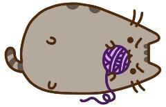

# cl-knot

Pusheen the Kitty came over to visit! After saying hello, you left her to play while you
grab snacks from the kitchen. A selection of nigiri to start, and peanut butter cups ready
for later. But then, Pusheen meows out to you! You find her, all tangled in some yarn!
Help Pusheen untangle herself from the yarn.

### To build and play

Clone the repository locally. Assuming that you have the necessary dependencies installed,
you can run `make cl-knot` to build the executable for the game, and then you can start
it by just running `/.cl-knot`. To rebuild, use `make clean; make cl-knot`.